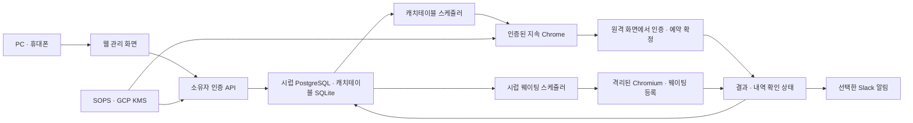

# OpenRun

OpenRun은 **가고 싶은 식당과 방문 일정을 등록해두면 예약·웨이팅 접수 시각에 서버가 실행하는 지인끼리 쓰는 서비스**입니다. 캐치테이블과 시럽프렌즈 등 업체별 접수 방식을 하나의 웹 화면, 일정 저장소, 알림 흐름으로 묶습니다.

서비스는 항상 켜져 있는 원격 머신에서 실행합니다. PC·휴대폰은 신청 관리와 필요한 인증을 담당하고, 실행 시각에 사용자의 로컬 PC가 켜져 있을 필요는 없습니다.

현재 우선 운영 대상은 **OCI k3s의 나니요리 시럽 웨이팅**입니다. 기존 homelab의 공용 PostgreSQL에 `openrun` 전용 DB를 두고, Docker target `waiting`은 캐치테이블 로그인·가상 데스크톱 없이 웹·시럽 스케줄러만 실행합니다. 서비스는 매일 켜져 있고, DB에 신청한 날짜·시간대가 있을 때만 접수합니다. `compose.waiting.yaml`로도 같은 PostgreSQL 저장 계층을 사용해 독립 실행할 수 있습니다.

## 전체 흐름

1. OpenRun 한 페이지에서 가게 탭을 고릅니다. 캐치테이블은 방문 일정을, 나니요리는 내일 오전 10시 명부에 인원수·전화번호를 입력합니다.
2. 서비스가 업체별 접수 시각을 한국 시간으로 계산하고 요청을 저장합니다.
3. 스케줄러가 해당 업체의 실행기를 호출합니다.
4. 실행기는 인증·입력·접수를 수행하거나 같은 서버 브라우저를 사용자에게 넘깁니다.
5. 결과와 확인이 필요한 상태를 웹 화면에 기록하고, 신청에서 선택한 경우 Slack으로 알립니다.


```mermaid
flowchart LR
  User["PC · 휴대폰"] --> Web["웹 관리 화면"]
  Web --> API["소유자 인증 API"]
  API --> DB["시럽 PostgreSQL · 캐치테이블 SQLite"]
  DB --> CT["캐치테이블 스케줄러"]
  DB --> Syrup["시럽 웨이팅 스케줄러"]
  CT --> Chrome["인증된 지속 Chrome"]
  Chrome --> Human["원격 화면에서 인증 · 예약 확정"]
  Syrup --> Worker["격리된 Chromium · 웨이팅 등록"]
  Human --> Result["결과 · 내역 확인 상태"]
  Worker --> Result
  Result --> DB
  Result --> Slack["선택한 Slack 알림"]
  KMS["SOPS · GCP KMS"] --> API
  KMS --> Chrome
```

## 업체별 현재 기능

| 업체 | 신청 내용 | 현재 실행 범위 |
| --- | --- | --- |
| 캐치테이블 | 매장, 방문 날짜·시간·인원, 예약을 준비할 시각 | 로그인·세션 재사용 → 매장 페이지 준비 → 원격 화면 인계. 시간·인원 최종 선택과 예약 확정·결제는 사용자 진행 |
| 시럽프렌즈 · 나니요리 | 내일 오전 10시 명부의 인원수·전화번호 | 2분 전 브라우저 준비 → 정각 1초 뒤 인원·전화번호 입력 → 확인 → 최종 제출 → 결과 저장 |

캐치테이블 초기 목록은 **모수 서울·노뜨르·베수비오**입니다. 접속 주소는 `/` 하나이며 활성화된 가게를 탭으로 표시합니다. 캐치테이블 매장을 추가하면 같은 화면에 새 탭이 생깁니다. 기존 `/waiting` 링크도 이 페이지로 연결됩니다.

나니요리 탭에는 **내일 오전 10시 명부**만 표시합니다. 인원수·전화번호를 입력하고, 같은 번호로 다시 신청하면 기존 인원수가 바뀝니다. 각 행의 **인원 수정**으로도 바로 바꿀 수 있습니다. 함께 가고 싶다면 기존 신청자에게 연락한 뒤 수정하는 방식입니다. 명부를 함께 쓰는 여러 관리 세션이 동시에 유지됩니다.

날짜·시간·상태를 별도로 고르지 않습니다. 휴무 예정일에는 다음 영업일로 넘기지 않고 내일의 휴무를 안내합니다. 매장 설정은 `src/waiting/config.ts`에서 관리하며 현재 휴무 예정일은 **월·목**입니다. 새 신청은 **09:58에 준비하고 10:00:01부터 시도**합니다. 이 설정은 최신 매장 정책을 보장하지 않으므로 운영 변경은 확인 후 반영합니다. 실행 흐름은 기존 [bots-on-lambda/syrupWaitingForNaniyori](https://github.com/yongseongkim/bots-on-lambda/tree/main/syrupWaitingForNaniyori)에서 이관했습니다.

## 시스템 구성

| 구성 요소 | 역할 |
| --- | --- |
| 웹 · API | 매장/예약/웨이팅 신청, 소유자 접근 권한, 요청 상태 조회 |
| PostgreSQL | 시럽 신청·실행 이력·결과 저장, 중복 신청 방지와 스케줄러 실행권 관리 |
| SQLite | 기존 캐치테이블 예약 준비와 명시적인 로컬 모의 테스트 저장소 |
| 업체별 스케줄러 | 접수 시각 판단, 실행 준비, 만료·중단·불확실한 결과 처리 |
| 캐치테이블 실행기 | 하나의 계정·지속 프로필을 직렬 사용하고 필요하면 noVNC로 사람에게 인계 |
| 시럽 실행기 | 로그인 없는 별도 브라우저 context에서 나니요리 접수. 최종 제출 직전 상태를 기록 |
| Slack | 사용자가 선택한 신청의 로그인 필요·예약 준비·웨이팅 실행 결과 알림 |
| SOPS · GCP KMS | 계정·관리 키·Webhook·캐치테이블 인증 스냅샷 암호화 |
| Docker · k3s | 시럽 전용 서비스와 공용 PostgreSQL 연결. 통합 모드는 Xvfb·x11vnc와 지속 데이터 볼륨도 사용 |

Node **26.13.0**, native TypeScript, Playwright를 사용합니다. 운영 시럽 데이터는 `DATABASE_URL`이 가리키는 PostgreSQL에 저장하고 앱 Pod는 데이터 볼륨 없이 교체할 수 있습니다. 신청과 실행 이력은 별도 테이블에 기록하며 최종 제출 직전 상태까지 트랜잭션으로 저장합니다. 전용 DB 세션의 advisory lock으로 스케줄러와 복구 실행을 하나로 제한합니다. 통합 모드의 기존 SQLite·캐치테이블 프로필·인증 상태는 `openrun-data`에 남습니다. AWS Parameter Store나 EventBridge를 사용하지 않습니다.

웨이팅 전화번호는 SOPS에서 읽은 관리 키로 파생한 키를 사용해 AES-GCM으로 암호화합니다. 화면과 API에는 마스킹한 번호만 표시합니다. DB를 이관할 때 같은 관리 키도 필요합니다.

## 실행

나니요리만 OCI에서 운영할 때는 PostgreSQL DB/계정과 `DATABASE_URL`, 관리 키를 먼저 준비합니다. 환경 변수/Kubernetes Secret 또는 기존 SOPS/GCP KMS 파일을 사용합니다. 네이버·카카오 계정은 필요하지 않습니다. [PostgreSQL 설정과 마이그레이션](docs/POSTGRESQL.md), [OCI 시럽 전용 실행 안내](docs/REMOTE_MACHINE.md#oci에서-나니요리만-실행)를 따릅니다.

```sh
docker compose -f compose.waiting.yaml build
docker compose -f compose.waiting.yaml run --rm --no-deps waiting npm run waiting:db:migrate
docker compose -f compose.waiting.yaml up -d --no-build
docker compose -f compose.waiting.yaml exec -T waiting npm run waiting:open
```

아래는 캐치테이블까지 함께 실행하는 통합 구성입니다.

Node/SOPS, Docker Compose, GCP KMS 접근을 준비한 뒤 실행합니다. 실제 비밀 파일은 공개 저장소에 포함하지 않습니다.

```sh
nvm install
nvm use
npm ci
npm run secrets:init
npm run secrets:edit
npm run remote:setup
docker compose up -d --build
npm run app:open
```

기존 SOPS 파일을 전달받았다면 `secrets:init`은 생략합니다. 관리 링크를 열고 **OpenRun 열기**를 누른 뒤 가게 탭을 고릅니다. 외부 PC·휴대폰 접속은 HTTPS 공개 주소가 필요하며, 설치·설정·이관 순서는 [원격 머신 실행 문서](docs/REMOTE_MACHINE.md)를 따릅니다.

## 상태와 실행 원칙

- 캐치테이블의 `READY`는 화면 준비, `COMPLETED`는 사용자의 내역 확인 완료입니다. 공급자가 확인한 예약 성공으로 해석하지 않습니다.
- 시럽의 `SUCCEEDED`는 완료 화면에서 대기 번호를 읽은 상태입니다. 최종 제출 후 결과를 잃으면 `UNKNOWN`으로 남기고 자동 재시도하지 않습니다.
- 신청 취소는 아직 실행하지 않은 서버 요청을 취소합니다. 이미 공급자에 등록된 예약·웨이팅을 취소하는 기능은 별도로 구현해야 합니다.
- CAPTCHA·추가 인증은 사람이 처리합니다. 실제 접수 조건·예약금·환불/노쇼 규정은 실행 전에 확인합니다.
- 서비스 정지·재시작·네트워크 지연이 있을 수 있어 접수 시각과 성공을 보장하지 않습니다. 여러 머신에서 같은 요청을 동시에 실행하지 않습니다.

## 개발과 문서

```sh
npm run browser:install
npm run check
npm test
npm run test:postgres
```

테스트는 모의 업체 응답을 사용합니다. 실제 계정·전화 수신자·예약·결제·Slack을 대상으로 검증하지 않습니다. GitHub Actions CI는 사용하지 않으며, 타입 검사·단위 테스트와 Docker 통합 테스트는 개발 환경에서 직접 실행합니다. 통합 테스트 실행 방법은 [개발 인계 문서](docs/DEVELOPMENT_HANDOFF.md#개발-및-검증)를 참고합니다.

- [개발 지침과 전체 구조](AGENTS.md)
- [PostgreSQL·DB 계정·마이그레이션·테스트](docs/POSTGRESQL.md)
- [캐치테이블 로그인·예약 준비](docs/CATCHTABLE.md)
- [나니요리 이관·내일 접수 명부](docs/SYRUP_WAITING.md)
- [원격 실행·설정·상태 이관](docs/REMOTE_MACHINE.md)
- [구현 상태와 미정 작업 인계](docs/DEVELOPMENT_HANDOFF.md)

다음 확장 대상은 업체별 접수 조건·결과 검증을 공통 흐름에 추가하고, 명시적으로 승인한 조건 안에서 예약 자동화 범위를 넓히는 것입니다. 구체적인 진행 상황과 날짜가 정해진 테스트 계획은 인계 문서에 기록합니다.
